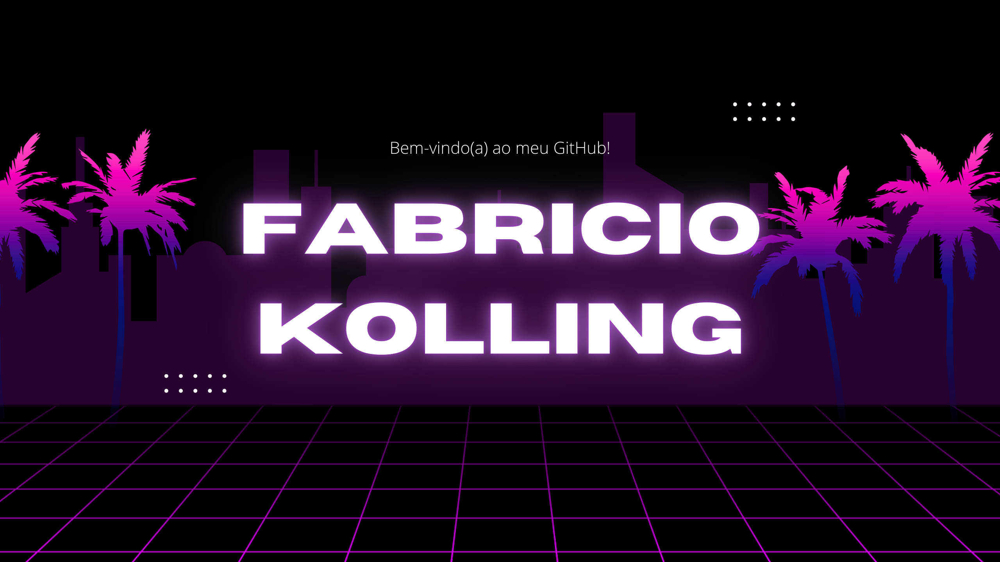

<h2 align="center" style="color: #8a2be2;">Hi there! Welcome to my GitHub! ↴</h2>

<h3>My Portfolio: <a href="https://portfolio-fabricio-2025.netlify.app" target="_blank">(Click here)</a></h3>

##

## GitHub Stats

 
  

## Tech Stack

### Languages & Web Technologies.

  
  
  
  

 

### Frameworks & Libraries

    
  
  
  

 

### Databases

    
  

## Contact

  
  

---

 

---

  
<b>👀</b>

  

    
  

